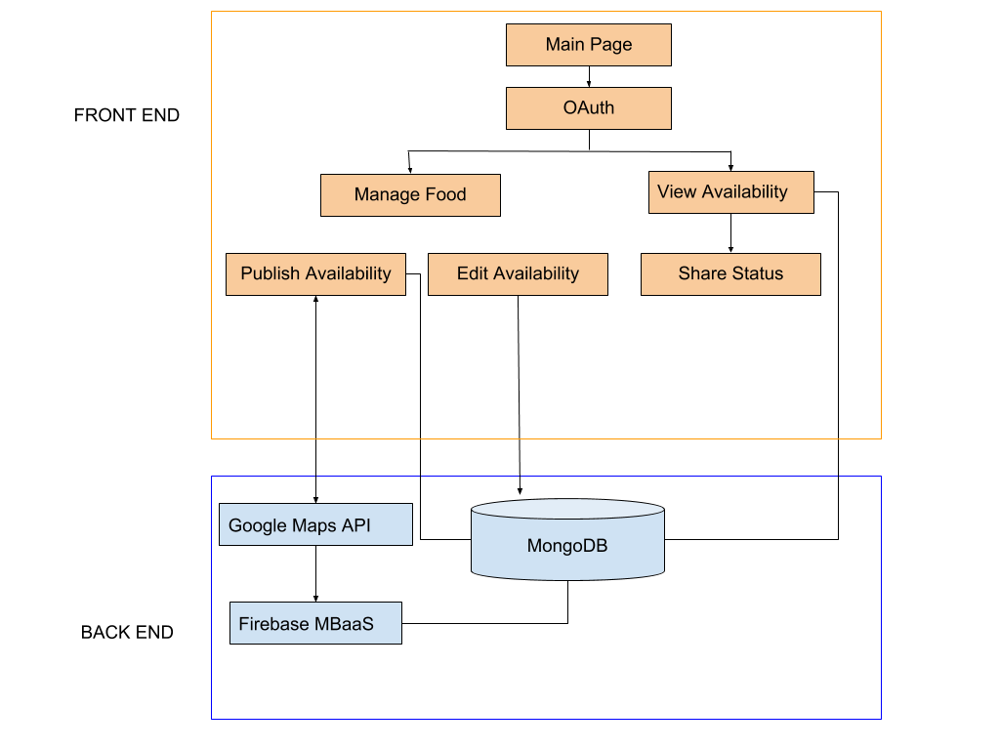

# Food Sharing App
An Android Application for Food Sharing within the Boston community

## Introduction
In the United States, some 60 million tons of food is thrown away annually. This has been a constant problem, especially when the homeless population in the US does not have a sign of dwindling. As a result, many people in the country does not have access to food despite the significant waste generated everyday in cities. 
This Android application aims to extend community involvements that restaurants, cafes and universities can participate in as this app enables easy food sharing with people with needs.

## User Stories
As a restaurant/cafe owner or university caterer, I would like to be able to log in to my account and share a status when I have food available to share

As a person who needs food, charity organizations or shelter, I would like see the amount of food available around me.

## Architecture

## Technology Stack
* Database: MongoDB
* API: Google Maps
* Authentication: OAuth
* IDE: Android Studio
* MBaaS: Firebase

## Task Assignments
Refer to docs/sprints

## Authors
Huzefa Mandviwala, Charles Thao